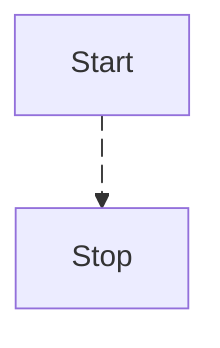

# Kalouk

Presentation slides with some niceties for math and programming

---

# What is Slidev?

Slidev is a slide maker and presentation tool designed for developers. It includes the following features:

- 📝 **Text-based** - focus on your content with Markdown, then style it later
- 🎨 **Themable** - themes can be shared and reused as npm packages
- 🧑‍💻 **Developer Friendly** - code highlighting, live coding with autocompletion
- 🤹 **Interactive** - embed Vue components to enhance your expressions
- 🎥 **Recording** - built-in recording and camera view
- 📤 **Portable** - export to PDF, PPTX, PNGs, or even a hostable SPA
- 🛠 **Hackable** - virtually anything that's possible on a webpage is possible in Slidev

<br>
<br>

Read more about [Why Slidev?](https://sli.dev/guide/why)

---

# What is Kalouk?

Kalouk is a set of tools and environments designed for teachers and students using math and programming. The Kalouk theme includes the following features:

- 📝 **New layouts** - equations, charts, step-by-step and more
- 🧑‍💻 **Quizzing** - built-in quizzing utility to test your viewers knowledge
- 🎨 **Catppuccin colors** - a pastel [theme](https://catppuccin.com/) for the high-spirited!

<br>
<br>

Read more about [Kalouk](https://kalouk.xyz)


---

# Navigation

Hover on the bottom-left corner to see the navigation's controls panel

## Keyboard Shortcuts

|     |     |
| --- | --- |
| <kbd>space</kbd> / <kbd>tab</kbd> / <kbd>right</kbd> | next animation or slide |
| <kbd>left</kbd>  / <kbd>shift</kbd><kbd>space</kbd> | previous animation or slide |
| <kbd>up</kbd> | previous slide |
| <kbd>down</kbd> | next slide |


---
layout: section
---

# Layouts

---
layout: fact 
---

# The Secret Sauce

Kalouk's layouts use PrimeVue UI components to enable new styles and functionality.

---
layout: subsection
---

# Kalouk Layouts

---
layout: grid
---

Kalouk provides a set of layouts specially suited for teaching and learning, with a focus on mathematics and programming for data analysis.

::A::
Grid

::B::
Equation

::C::
Chart

::D::
Quiz

::E::
Steps

::F::
Code

::G::
Process

::H::
Exercise

::I::
Jupyter

::bottom::

Find out more in the next slides!

---

# Grid

A practical layout to show important elements with up to nine cards.

```md
---
layout: grid
---

# Title of the Grid

::A::
Content A

::B::
Content B

(...C, D, E, F, G, H...)

::I::
Content I

::bottom::
Further explanation, if required
```

---
layout: grid
---

# Title of the Grid

::A::

A

::B::

B

::C::

C

::D::

D

::E::

E

::F::

F

::G::

G

::H::

H

::I::

I

::bottom::

Further explanation, if required

---

# Equation

Showing an equation in its full glory with an extra big font.

```md 
---
layout: equation
---

# Title of the Equation

::equation::

E = mc^2

::bottom::

$E$ is the energy, $m$ is the mass, and $c$ is the speed of light.
```

---
layout: equation
---

# Title of the Equation

::equation::

$$
E = mc^2
$$

::bottom::

$E$ is the energy, $m$ is the mass, and $c$ is the speed of light.

---

# Chart

Good-looking charts with PrimeVue's Chart.js-powered component, with data from Kalouk API or any other Schema.org's Dataset type-compliant source.

```md
---
layout: chart
dataset: ingresos-semanales
type: line
---

# Title of the Chart

::bottom::

Footer content
```

---
layout: chart
dataset: ingresos-semanales
type: line
---

# Title of the Chart

::bottom::

Footer content

---

# Quiz

Test your readers with a quiz with up to four options to choose from.

```md
---
layout: quiz
answer: B
---

# Title of the Quiz

::statement::

Statement of the quiz

::A::
Option A 

::B::
Option B
```

---
layout: quiz
answer: B
---

# Title of the Quiz

::statement::

Statement of the quiz

::A::
Option A

::B::
Option B

::C::
Option C

---

# Steps

A layout to show a sequence of steps, with a progress bar and navigation.

```md
---
layout: steps
---

# Title of the Steps

::step{header="Header 1" value="1"}
The content of step 1
::

::step{header="Header 2" value="2"}
The content of step 2
::

::step{header="Header 3" value="3"}
The content of step 3
::
```

---

# Title of the Steps

<Stepper />

---

# Code

This layout is for showing code snippets with syntax highlighting and line numbers, that executes the code in the browser and shows the output.

```md
---
layout: code
---

# Title of the Code

'''py {monaco-run}
from termcolor import colored

print(colored("Hello, Slidev!", "blue"))
'''
```

---

# Title of the Code

```py {monaco-run}
from termcolor import colored

print(colored("Hello, Slidev!", "blue"))
```

---

# Jupyter Lite

---
layout: iframe
url: https://jupyter.org/try-jupyter/lab/
---

---
layout: subsection
---

# Slidev Layouts

*Kaloukified*

---
layout: two-cols
---

# Left

This shows on the left

::right::

# Right

This shows on the right

---
layout: two-cols-header 
---

# This spans both

::left::

# Left

This shows on the left

::right::

# Right

This shows on the right

::bottom::

This shows at the bottom, aligned to the end (bottom) of the grid

---

# Mermaid



---
layout: image-right
image: https://cover.sli.dev
---

# Side image (right or left)

So many things to say here.

---
layout: end
---

# Learn More

[Documentation](https://sli.dev) / [GitHub Repo](https://github.com/slidevjs/slidev)
